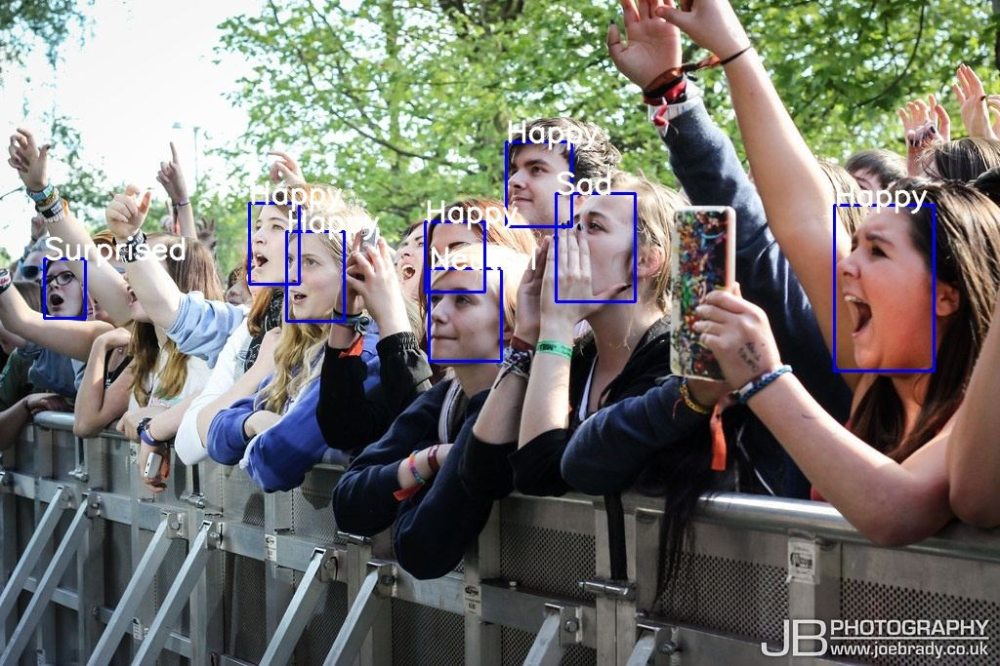

# Emotion detection using deep learning

## Introduction

This project aims to classify the emotion on a person's face into one of **seven categories**, using deep convolutional neural networks. The model is trained on the **FER-2013** dataset which was published on International Conference on Machine Learning (ICML). This dataset consists of 35887 grayscale, 48x48 sized face images with **seven emotions** - angry, disgusted, fearful, happy, neutral, sad and surprised.

## How to install 
* Models for face detection:

```bash
cd docker
```
Download tensorrt from https://developer.nvidia.com/compute/machine-learning/tensorrt/secure/7.0/7.0.0.11/local_repo/nv-tensorrt-repo-ubuntu1804-cuda10.0-trt7.0.0.11-ga-20191216_1-1_amd64.deb

```
docker build -t emotions -f Dockerfile .
```

Download weights for retinaface and arcface neural networks and move them to src/tensorrtx/retinaface and src/tensorrtx/arcface respectively

Run docker container. (for instance: docker run --gpus 0 -it -p 8123:8888 -v /opt/perchenko/emotions:/emotions emotions)

```
sh build.sh
```
* Models for emotion recognition:

Download model.h5 from [here](https://drive.google.com/file/d/1FUn0XNOzf-nQV7QjbBPA6-8GLoHNNgv-/view)

Put it into /src.

* To install the required packages, run `pip install -r requirements.txt`.

## Basic Usage

* To test the emotion recognition model put your images to folder `/src/data/test`

* To view the predictions using pretrained model run:  

```bash
cd src
python emotions.py --mode display
```
* Find the results `/src/data/results`

* In `/src/data` you will also find .csv files with statistics for all images. 


## Algorithm

* First, faces are detected with the [method](https://gitlab.mtsai.tk/ai/ml/CV/mts_media/actors/-/tree/dev/face).

* The region of image containing the face is resized to **48x48** and is passed as input to the CNN.

* The network outputs a list of **softmax scores** for the seven classes of emotions.

* The emotion with maximum score is displayed on the screen.

## Example Output




